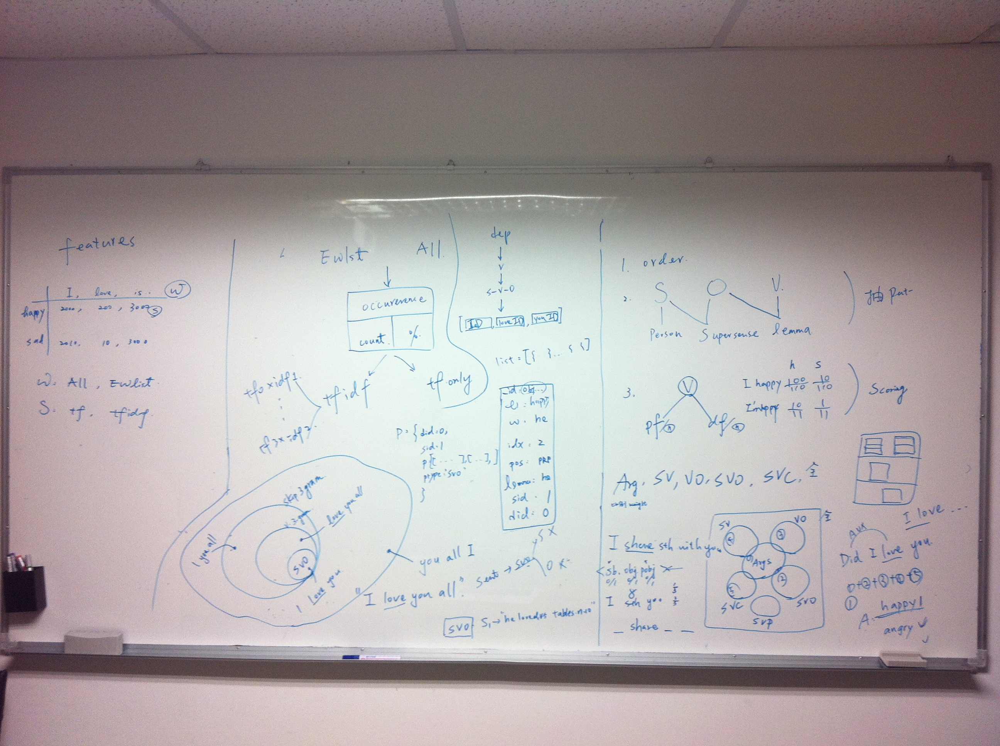

###Pattern

* #### Pattern 產生

	verb + \< subj, obj, prep_obj, be_adj \>
		

* #### Pattern 結構
	
	1. `Semantic roles`：主詞、受詞
	2. `人稱`：John --> SUBJ_3
	3. `時態`：had --> have

	
* #### Pattern 分數

	1. 長 pattern --> 高分

		<pre>sent: I really wish I <u>have</u> someone ...
	    SV: <b>i have</b>
	   SVO: <b>i have someone</b>
	  Args: <b>wish i have someone</b> </pre>
	  
	  * pattern長度
	  * pattern長度/sentence長度
		

	2. pf, df or pf-idf
 
	3. Multiple Lexicons
	
		* <b>Lexicon_Happy</b>: `Prob(pattern, Happy)`
		* <b>Lexicon_Sad</b>: `Prob(pattern, Sad)`
		* ...
		* <b>Lexicon_Anger</b>: `Prob(pattern, Anger)`
	
	
		---
		
			p1 < Prob(p1, Happy), Prob(p1, Sad), ..., Prob(p1, Anger) >
			
			p2 < Prob(p2, Happy), Prob(p2, Sad), ..., Prob(p2, Anger) >
			
			...
			
			pk < Prob(pk, Happy), Prob(pk, Sad), ..., Prob(pk, Anger) >
		
		
		---
		
		* #####predict as _True_ if prob > 0.5 else _False_
		
				p1 < 0, 1, ..., 1 >
	
				p2 < 1, 1, ..., 1 >		
	
				...

				pk < 1, 0, ..., 0 >	

* ####To do

	1. 只動testing stage: pattern占sentence的比例 (固定一種結構)
	
	3. 只動testing stage: pattern占sentence的比例 (多種結構)

	2. 只動testing stage: pattern的長度 (多種結構) 

	1. `done` mongo sentences, deps 加 unique id
	
	1. 列出一篇可以抽出哪些 pattern，把 SV, SVO, VO, SVC, Args 都放在一起

			{
				pattern: "i _love you",
				anchor: "love",
				anchortype: "verb",
				dID: 1,
				sID: 2,
				vidx: 13,
				negation: True,
				pLen: 3
				sLen: 10
				rule: 
				{
					'subject': 1,
					'object' : 1,
					'prep'   : 0
				}
			}
	
	1. 建lexicon
	
		* micro/macro average
		* e.g., 
		
			[10, 0, ..., 0, 100, 0, ...] -->  `not Happy` 

			[10, 0/39, ..., 0/39, 100/39, 0/39, ...] --> `Happy` 

	2. 統一有一個抽 pattern 的模組，把 pattern 全部抽出來，才進行分類
	
	1. formulate scoring functions 
	
		1. pattern
		2. document

* 截圖

	 

---

* ####database

	* LJ40K > sents
	
			{
				"_id" : ObjectId("531944ac3681dfca09875205"),
				"emotion" : "accomplished",
				"udocID" : 0,
				"usentID" : 0,
				
				"sent_length" : 10,
				"sent_pos" : "I/PRP got/VBD new/JJ hair/NN :/: O/RB omfg/VBG I/PRP love/VBP it/PRP",
				"sent" : "I got new hair : O omfg I love it"
			}		
	
	
	* mongo > mapping
	
			{
			        "_id" : ObjectId("52fc4aa93681df69081246f5"),
			        "docID" : 0,
			        "emotion" : "accomplished",
			        "local_docID" : 0,
			        "path" : "LJ40K/accomplished/0.txt"
			}
	
	* mongo > patterns
	
			{
				"_id" : ObjectId("5305729f3681dfda4a9c52d5"),
				"pattern": "you given me",
				"structure": "SVO",
				"df": [<40 elements>],
				"ndf": [<40 elements>],
				"pf": [<40 elements>],
				"npf": [<40 elements>]		
			}

	* LJ40K > deps

			{
				"_id" : ObjectId("531944ac3681dfca098751fc"),
				
				"emotion" : "accomplished",
				"udocID" : 0,
				"usentID" : 0,
				"sent_length" : 10,
					
				"rel" : "nsubj",
				"x" : "got",				
				"xIdx" : 2,
				"xPos" : "VBD",
				
				"y" : "I",				
				"yIdx" : 1,				
				"yPos" : "PRP"
			}

* ####容易發生的小 bugs
	

	1. 縮寫：'re `(are)`，'ll `(will)`
	2. 大小寫：You, you

