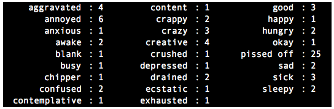
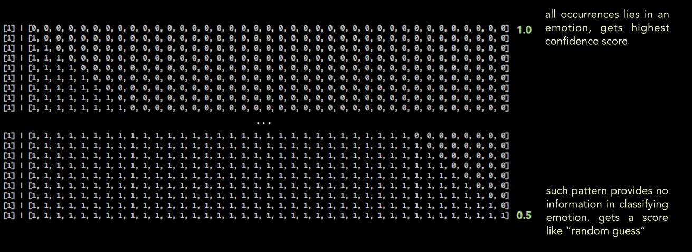
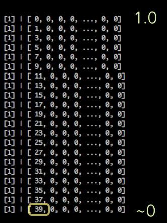
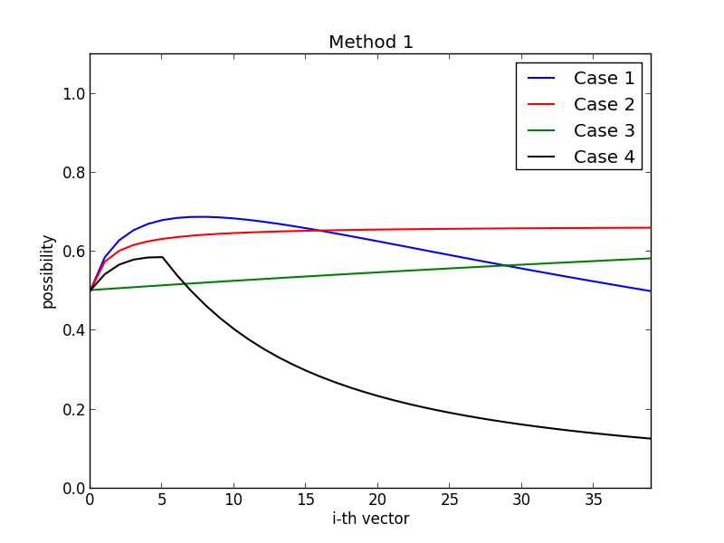
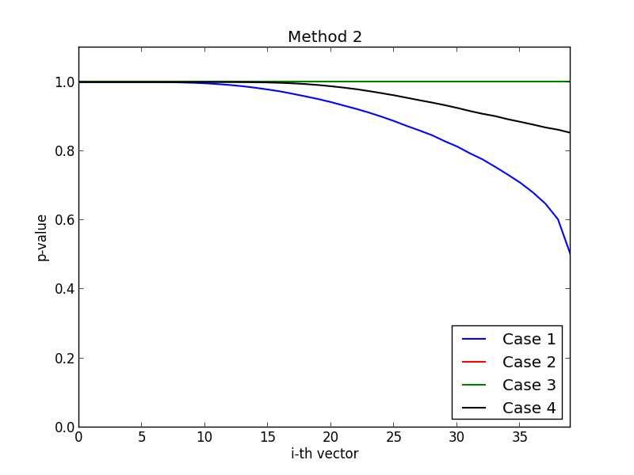
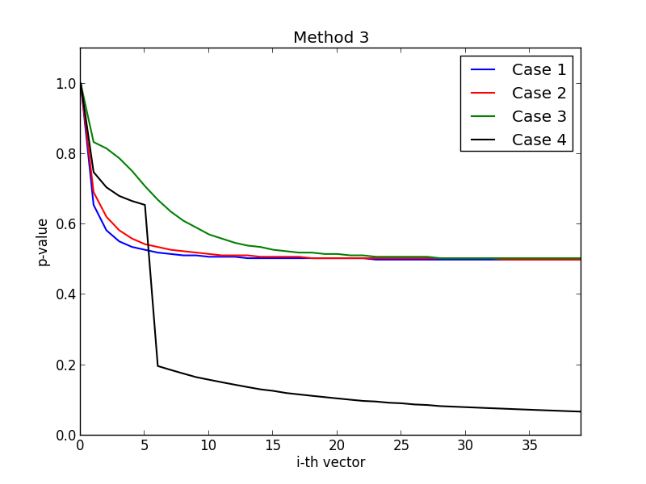

Pattern scoring
===

* Given a pattern, we calculate its confidence score in each emotion.

	

	e.g., 

	* pattern: `i am pissed`

	* occurrences:

		
	
	* idea:
	
		separate the occurrences of `emotion` and `!emotion`
		
		all emotins: [4, 6, 1, 2, ..., 1, 25, 2, 3, 2]
		
		annoyed | !annoyed |
		------------ | ------------- |
		[6] | [ 4, ~~6~~, 1, 2, ..., 1, 25, 2, 3, 2 ]  |		

		pissed off | !pissed off |
		------------ | ------------- |
		[25] | [ 4, 6,1, 2, ..., 1, ~~25~~, 2, 3, 2 ]  |	
	
		sleepy | !sleepy |
		------------ | ------------- |
		[2] | [ 4, 6,1, 2, ..., 1, 25, 2, 3, ~~2~~ ]  |


> How to consider the __scale__ (frequency) and the __distribution__ at the same time?

How
===

* origin thoughts

	annoyed | !annoyed |
	------------ | ------------- |
	[6] | [ 4, ~~6~~, 1, 2, ..., 1, 25, 2, 3, 2 ]  |
	
	```python
	6 : (4+1+2+...+1+25+2+3+2)/39
	-> 6 : 1.74
	-> score("i am pissed", annoyed) = 6/(6+1.74) = 0.77
	```
	

* However, this method doesn't work:

	consider the following two cases, two totally different distribution but yield the same score

	 cases | happy | !happy |
	------------|------------ | ------------- |
	1 | [ 9 ] | [ 1, 1, 1, ..., 1, 1 ]  |
	2 | [ 9 ] | [ 39, 0, 0, ..., 0, 0 ]  |

	* in Case 1:
		
		```python
		9 : (1+1+...+1)/39
		-> 9: 1
		-> score(pattern, happy) = 0.9
		```			
	
	* in Case 2:
		
		```python
		9 : (39+0+...+0)/39
		-> 9: 1
		-> score(pattern, happy) = 0.9	
		```		
		
		In both two cases, they have the same sum (i.e., 39) in each `!happy` vector.
		
		However, in Case 2, we know that 39 is centralized in one emotion, and that emotion belongs to `!happy`. So the score of the pattern in emotion happy will be very low. (close to 0)

		

		


Curret results
===

* Methods:
	
	* [Method 1](#method-1): the one we currently used
	
		
		
		
	
	* [Method 2](#method-2): P-value (proposed by Dr. Penguin)

		calculate the Z-score like <a href="https://gist.github.com/maxis1718/9829984" target="_blank">this</a>
		
		then look up the <a href="http://images.tutorvista.com/cms/images/67/Positive-Z-score-chart.jpg" target="_blank">table</a> to obtain P-value

	* [Method 3](#method-3): Model the data as a Gaussian distribution

---	

#### * Case 1

	x| happy | !happy |
	------------ | ------------ | ------------- |
	1|[ 1 ] | [ 1, 0, 0, ..., 0, 0 ]  |
	2|[ 1 ] | [ 1, 1, 0, ..., 0, 0 ]  |
	3|[ 1 ] | [ 1, 1, 1, ..., 0, 0 ]  |
	...|... | ...  |
	39|[ 1 ] | [ 1, 1, 1, ..., 1, 1 ]  |


#### * Case 2

	x|  happy | !happy |
	------------ | ------------ | ------------- |
	1|[ 1] | [ 1, 0, 0, ..., 0, 0 ]  |
	2|[ 2 ] | [ 1, 1, 0, ..., 0, 0 ]  |
	3|[ 3 ] | [ 1, 1, 1, ..., 0, 0 ]  |
	...|... | ...  |
	39|[ 40 ] | [ 1, 1, ..., 1 ]  |

#### * Case 3

	x|  happy | !happy |
	------------ | ------------ | ------------- |
	1|[ 10 ] | [ 1, 0, 0, ..., 0, 0 ]  |
	2|[ 10 ] | [ 1, 1, 0, ..., 0, 0 ]  |
	3|[ 10 ] | [ 1, 1, 1, ..., 0, 0 ]  |
	...|... | ...  |
	39|[ 10 ] | [ 1, 1, 1, ..., 1, 1 ]  |

#### * Case 4

	x| happy | !happy |
	------------ | ------------ | ------------- |
	1|[ 1 ] | [ 1, 0, 0, ..., 0, 0 ]  |
	2|[ 1 ] | [ 2, 0, 0, ..., 0, 0 ]  |
	3|[ 1 ] | [ 3, 0, 0, ..., 0, 0 ]  |
	...|... | ...  |
	39|[ 1 ] | [ 39, 0, 0, ..., 0, 0 ]  |


---

#### Method 1



#### Method 2



#### Method 3


